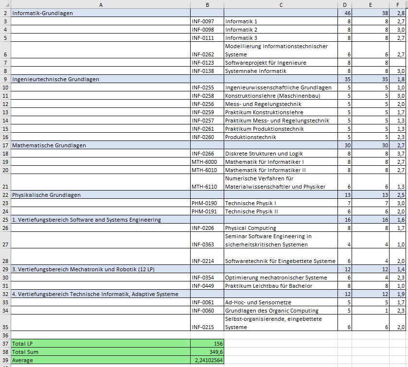
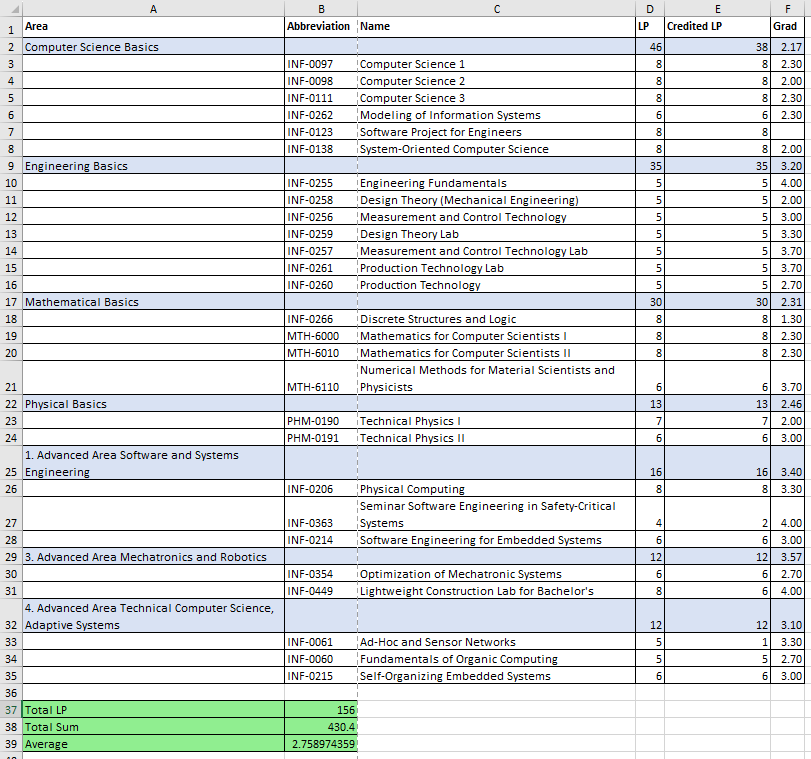

# Average Score Calculator

In this project, I extracted and analyzed my university grades from a PDF to calculate my average score. The main goal was to practice code structuring, including type hints, good exception handling, and docstrings. Additionally, this tool allows easy calculation of scores for my classmates.

## PDF Overview

Here's an example of the PDF used for extracting grades:

## Method

First, I extracted all the text from the PDF line by line and filtered out only the lines with the subjects. The average grade is calculated by the formula: 

\[ \text{Average} = \frac{\sum (\text{Grade} \times \text{LP})}{\text{Total LP}} \]

Challenges included handling areas with more LP than needed, ensuring only the best grades are counted.

I used two classes for data structuring: one for subjects and one for areas. Subjects were assigned to their respective areas with necessary information like grade and LP. If there were too few points, the output indicated how many points were missing. If there were too many LP, only the best subjects were counted.

## Result

The resulting average score is printed in the console. Additionally, an Excel sheet with all the information about subjects, grades, and the resulting average is created. Here’s an example:

Here's the same version with GDA Grades and English translation of the subjects:

My average score is 2.24, corresponding to a GDA of approximately 2.76. I also received my thesis grade of 2.3 (equivalent to a 2.7 in GDA Grades), which doesn't significantly change my overall average. While not the highest, there were challenges with my supervisor, and the topic wasn't of future interest to me.

From the docstrings, I created automatic documentation detailing all functions. Unfortunately, I lost the code when my laptop broke down and hadn't pushed it to Git yet. Trust me, I really did make that documentation and may recreate it someday.

